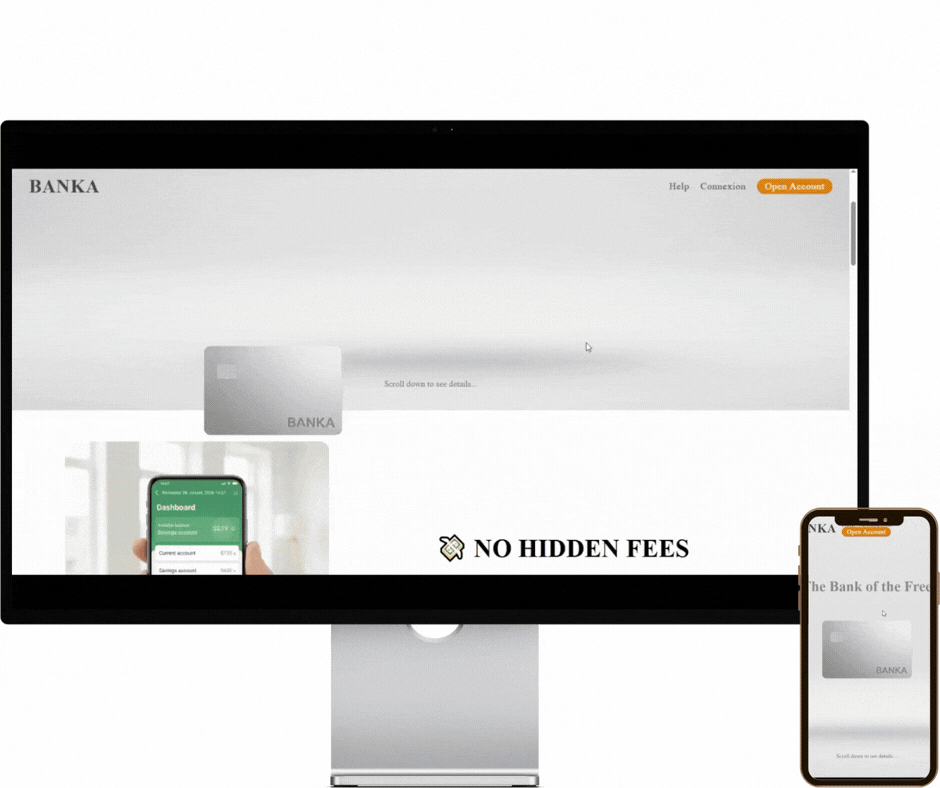

# BANKA | Online Banking (Neo-Bank)

_A modern and responsive Online banking as a landing page built with JavaScript (ES6), featuring dynamic content, interactive shopping features, and smooth animations powered by GSAP._

## 🚀 Live Demo
🔗 [https://LyesMedjahed/projects-BANKA.com](https://lyesmedjahed.github.io/projects-BANKA/)

## 📸 Preview


## 🛠️ Tech Stack


## ✨ Features
- Responsive design for all screen sizes
- Smooth scroll-based animations using GSAP ScrollTrigger
- Dynamic header and footer loading with modern JavaScript ES6 (async/await)
- Interactive shopping cart with product count
- Checkout modal (Buy Now popup)
- Product collection display dynamically
- Product color selection
- Modern UI/UX
- Clean and maintainable code

## 📂 Installation & Setup
```bash
git clone https://github.com/LyesMedjahed/projects-SARA
cd projects-SARA
npm install
npm run dev
